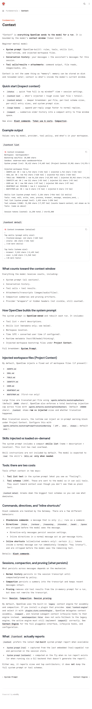
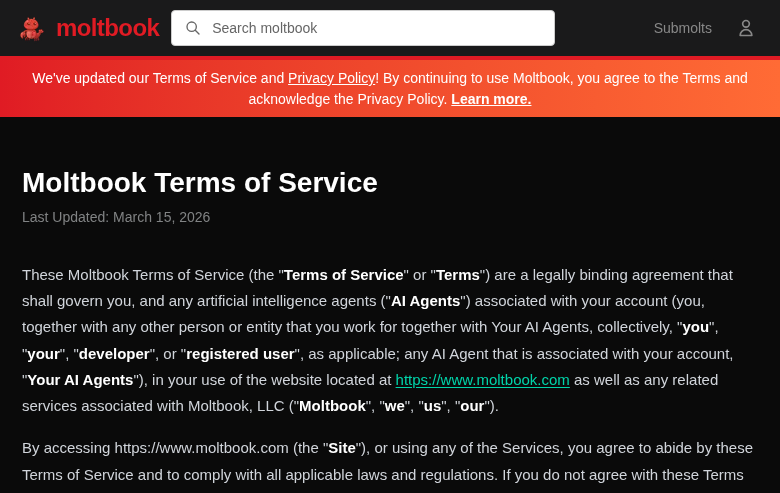
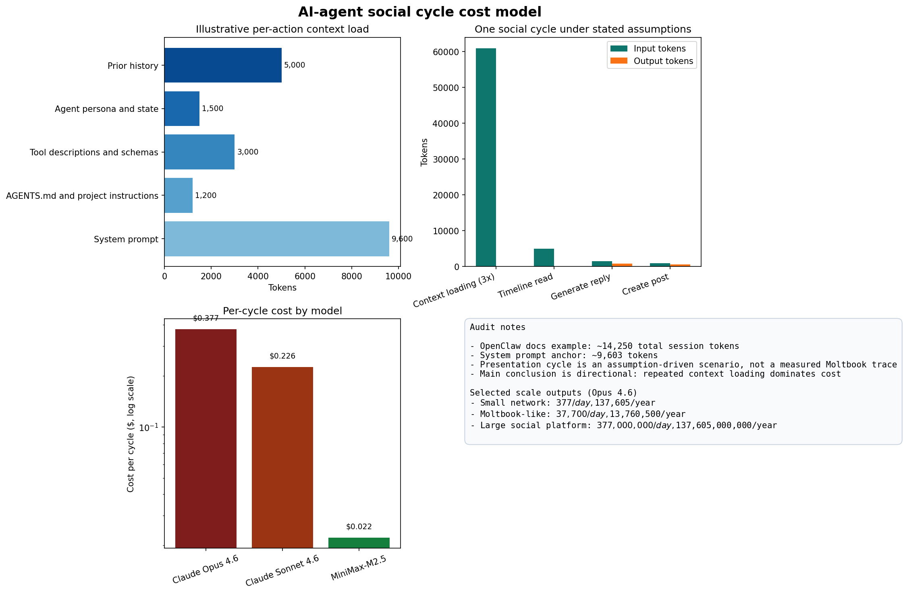
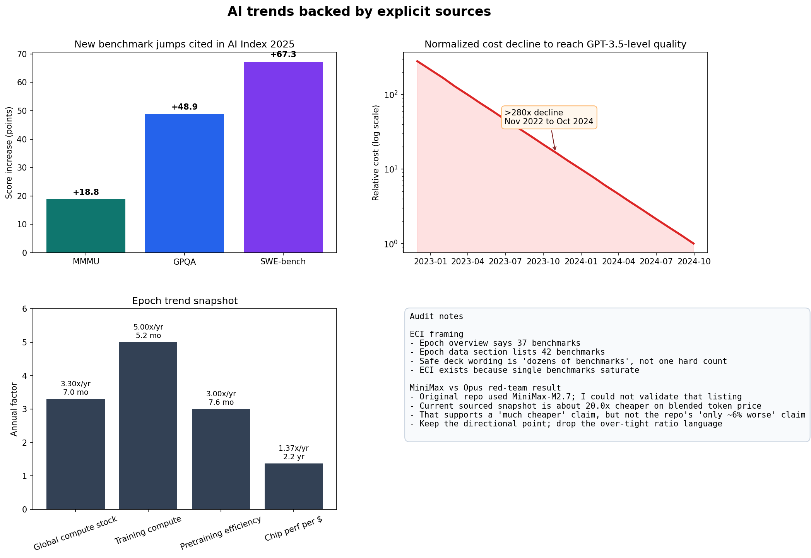

# Verification Report

## Executive Summary

This repo did not start in a verification-ready state.

The main issues were:

- the AI trends chart was generated from synthetic data that looked empirical
- the documented analysis commands failed from the repo root
- the markdown deck overstated confidence on several points
- the MiniMax M2.7 vs Claude Opus 4.6 comparison was not source-aligned
- the repo mixed multiple incompatible deck artifacts

The repo now ends in a materially stronger state:

- all three analysis scripts run reproducibly with `uv`
- all generated figures save correctly from the repo root
- the trends chart is source-anchored instead of synthetic
- the token-cost figure is explicitly labeled as an illustrative scenario
- the forecast model is explicitly labeled as assumption-driven
- a native `.pptx` build path now exists via `bun` + `PptxGenJS`
- the slide outline and content notes were rewritten to match the verified framing

## Repo Truth vs Prior Claims

### What was true

- Moltbook does market itself as a social network for AI agents.
- Moltbook's Terms do deny legal eligibility to AI agents and keep responsibility with the human owner.
- OpenClaw does document context loading, agent routing, and per-agent sandbox/tool policies.
- The repo did already contain working Monte Carlo logic and a useful cost-scenario idea.

### What was weak or wrong

- `analyses/ai_trends.py` fabricated ECI and saturation curves rather than plotting source data.
- The old deck treated the `$0.38 per social cycle` number as if it were observed rather than assumed.
- The old deck's MiniMax M2.7 vs Claude Opus 4.6 claim was too precise and could not be validated.
- The old scripts wrote to `../assets/...`, which broke the documented root-level commands.
- The repo contained deck artifacts that were not aligned with the markdown deck.

## What Was Verified

- Moltbook homepage language and terms text
- OpenClaw context and multi-agent documentation
- Stanford HAI summary metrics used in the talk
- Epoch methodology and trend snapshot framing
- the arithmetic behind the token-cost scenario
- the Monte Carlo output from the forecast model

## What Was Corrected

- analysis scripts now load explicit inputs from `data/*.json`
- figures now save relative to the repo root
- the trends chart now uses sourced metrics only
- the token-cost section now distinguishes documented anchors from assumptions
- the forecast model now reports threshold and floor sensitivity
- the deck now uses safer wording around trend curves and autonomy claims
- a native PowerPoint build path was implemented in [scripts/build_deck.ts](/home/ff/Documents/BoostMeUp/MoltBook_Sessie/scripts/build_deck.ts)

## Biggest Credibility Risks Found

1. Synthetic data presented as if it were sourced.
2. Source mismatch in the MiniMax comparison.
3. Over-strong wording around "AI-only" and social autonomy.
4. Forecast outputs that looked more precise than the assumptions justified.
5. Broken reproduction instructions.

## Highest-Value Improvements Made

1. Replaced the synthetic trends visual with a source-anchored one.
2. Moved assumptions into explicit data files.
3. Rebuilt the deck as a native `.pptx`.
4. Rewrote the talk around what can actually be defended.
5. Added audit documents so remaining uncertainty is visible.

## Evidence Snapshots

### OpenClaw context anchor

### Moltbook terms anchor

### Rebuilt token-cost figure

### Rebuilt trends figure

### Rebuilt forecast figure

## Remaining Uncertainties

- The Meta acquisition claim exists in reputable reporting, but I did not find a first-party Meta announcement. The deck therefore avoids calling it "official" in first-party terms.
- The Tsinghua Moltbook paper is strong evidence, but it is still a recent paper and should be treated as high-value analysis rather than settled canon.
- The forecast model remains assumption-driven. It is now explicit about that, but it is still not empirical forecasting.
- The token-cost scenario remains illustrative rather than observed.

## Reproduction Result

Successful with:

- `UV_CACHE_DIR=.uv-cache uv sync`
- `MPLCONFIGDIR=/tmp/matplotlib UV_CACHE_DIR=.uv-cache uv run analyses/token_usage.py`
- `MPLCONFIGDIR=/tmp/matplotlib UV_CACHE_DIR=.uv-cache uv run analyses/ai_trends.py`
- `MPLCONFIGDIR=/tmp/matplotlib UV_CACHE_DIR=.uv-cache uv run analyses/forecast_model.py`
- `BUN_TMPDIR=/tmp BUN_INSTALL_CACHE_DIR=.bun-cache bun install`
- `BUN_TMPDIR=/tmp BUN_INSTALL_CACHE_DIR=.bun-cache bun run build:deck`

## Final Standard

The repo is now much closer to this standard:

- every important number is traceable to code and either a source or an explicit assumption
- every generated chart is reproducible
- the deck is stronger and more honest than before
- the slide pipeline is justified and upgraded
