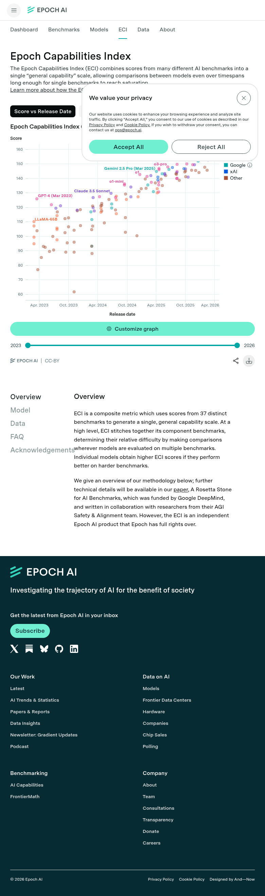

# Deel 5: AI Trends - De onderliggende machine

## De hoofdstelling (20-25 minuten)

> **"De snelste trend zit vandaag vooral in efficiëntie, kosten en compute-capaciteit; capability-metrics stijgen vaak ook heel snel, maar individuele benchmarks satureren en vlakken soms af."**

---

## Screenshot: Epoch Capabilities Index

*Bron: https://epoch.ai/benchmarks/eci*

---

## 1. Algemene capability: Epoch Capabilities Index (ECI)

### Wat is ECI?

Epoch bouwde de **Epoch Capabilities Index** omdat individuele benchmarks te snel verzadigen. ECI combineert **37 benchmarks** tot één algemenere capability-schaal over tijd.

### Waarom beter dan één benchmark?

| Probleem met één benchmark | ECI oplossing |
|---------------------------|---------------|
| Snelle saturatie | Combinatie van 37 benchmarks |
| Opgeblazen scores door training | Bredere maatstaf |
| Niet representatief | Samengestelde index |

### Trend:
- **ECI stijgt consistent** over tijd
- Geeft beter beeld van algemene vooruitgang
- Minder gevoelig voor "benchmark hacking"

---

## 2. Benchmark sprongen: de nieuwe moeilijke benchmarks

Stanford HAI rapporteert enorme stijgingen op nieuwe, moeilijke benchmarks in één jaar:

| Benchmark | Stijging (punten) | Wat het meet |
|-----------|------------------|--------------|
| **MMMU** | +18.8 | Multimodal understanding |
| **GPQA** | +48.9 | Graduate-level reasoning |
| **SWE-bench** | +67.3 | Software engineering tasks |

### Interpretatie:

- Op de **moeilijkste nieuwe benchmarks** zie je soms geen rustige lineaire groei, maar **echte sprongen**
- Dit toont dat **frontier capabilities** momenteel hard versnellen
- Maar: oude benchmarks **satureren snel**

---

## Screenshot: Stanford HAI AI Index 2025

*Bron: https://hai.stanford.edu/ai-index/2025-ai-index-report*

---

## 3. Efficiëntie: de sterkste exponentiële trend

### De meest overtuigende grafiek:

**Inference kost om GPT-3.5-niveau te halen:**
- **>280× gedaald** tussen november 2022 en oktober 2024

### Hardware trends (Stanford HAI):

| Metric | Jaarlijkse verbetering |
|--------|----------------------|
| Kosten per compute | ~30% per jaar |
| Energie-efficiëntie | ~40% per jaar |
| AI-chip performance/$ | ~37% per jaar (Epoch) |

### Waarom dit belangrijk is:

> **"De vraag is niet alleen of AI slimmer wordt. De vraag is ook: hoeveel slimmer per euro? En daar zie je momenteel de hardste curve."**

---

## 4. Compute: waarom de curves blijven stijgen

### Wereldwijde AI compute capaciteit (Epoch):

| Metric | Waarde |
|--------|--------|
| Groei sinds 2022 | ~3.3× per jaar |
| Verdubbelingstijd | ~7 maanden |

### Frontier training runs:

| Metric | Waarde |
|--------|--------|
| Kost stijging sinds 2020 | ~3.5× per jaar |
| Pre-training compute efficiency | ~3.0× per jaar |

### Het dubbele verhaal:

De sector gooit er tegelijk **meer compute** én **betere algoritmische efficiëntie** tegenaan.

---

## 5. De tegenvaller: niet alles is exponentieel

### Anti-hype slide: saturatie

Stanford merkt op dat benchmarks steeds sneller verzadigen:

| Feit | Implicatie |
|------|-----------|
| **~50% van benchmarks** vertoont saturatie | Plateaus in prestatie |
| Hogere saturatie bij oudere benchmarks | S-curve gedrag |
| Chatbot Arena gap 2023: 4.9% | Top 2 verschil |
| Chatbot Arena gap 2024: 0.7% | Convergentie |

### Wiskundige realiteit:

> **Een benchmark tussen 0 en 100% kan mathematisch niet eeuwig exponentieel blijven.**

---

## 6. Drie soorten curves

| Type | Gedrag | Voorbeeld |
|------|--------|-----------|
| **Capability-composieten** | Vaak sterk stijgend | ECI |
| **Efficiëntie-/kostencurves** | Meest exponentieel | Inference kosten |
| **Losse procentbenchmarks** | Snel stijgend, dan verzadigend | MMLU, individuele tests |

### Slide styling tips:

- Gebruik **log-schaal** voor kost/compute-grafieken
- Gebruik **gewone schaal** voor procentbenchmarks
- Zet bij procentbenchmarks expliciet "**bounded metric**" of "**saturates**"

---

## 7. Casus: MiniMax M2.7 vs Claude Opus 4.6

### Prijs-prestatie vergelijking (Artificial Analysis):

| Model | Intelligence Index | Snelheid | Input prijs | Output prijk |
|-------|-------------------|----------|-------------|--------------|
| **Claude Opus 4.6** | 53 | ~44 t/s | $5 / 1M | $25 / 1M |
| **MiniMax-M2.7** | 50 | ~44.5 t/s | $0.30 / 1M | $1.20 / 1M |

### Prijsverschil:

| Vergelijking | Factor |
|--------------|--------|
| Input | **16.7× goedkoper** |
| Output | **20.8× goedkoper** |
| Blended | **~18.9× goedkoper** |

### Kwaliteitsverschil:

- Intelligence Index: **slechts ~6% lager**
- Snelheid: **praktisch gelijk**

### Conclusie:

> **"De frontier schuift nog steeds omhoog, maar de echt ontwrichtende trend is dat bruikbare agent-capaciteit steeds goedkoper wordt."**

---

## 8. Samenvattende boodschap

> "Dus wat zien we? Niet dat elke benchmark netjes exponentieel omhoog gaat. Wel dat de onderliggende machine sneller, goedkoper en capabeler wordt. Sommige benchmarks schieten omhoog, andere satureren. Maar economisch gezien wordt agentische AI wel steeds haalbaarder. En dat is precies waarom projecten zoals OpenClaw en Moltbook interessant zijn: niet omdat ze al af zijn, maar omdat de randvoorwaarden — compute, prijs en capability — razendsnel aan het verschuiven zijn."

---

## Grafiek overzicht voor slides

| Slide | Titel | Type | Y-as |
|-------|-------|------|------|
| 1 | Epoch Capabilities Index | Line chart | Index (0-100) |
| 2 | Benchmark Sprongen | Bar chart | Punten stijging |
| 3 | Inference Kosten Trend | Line chart (log) | Kosten ($) |
| 4 | AI Compute Capaciteit | Line chart (log) | FLOPS |
| 5 | Benchmark Saturatie | Multi-line | Percentage |
| 6 | MiniMax vs Opus | 2×2 matrix | Prijs vs Kwaliteit |
