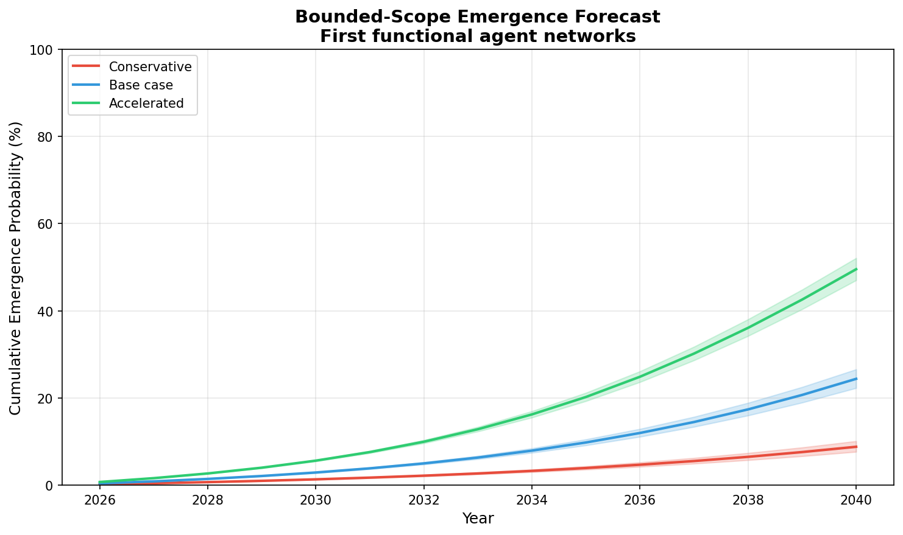

# Deel 6: Forecast model

## Waarom er überhaupt een forecast in zit

Na alle kritiek op hype en overclaims kan een forecast-sectie tegenintuïtief lijken. Als de sessie juist voorzichtig wil zijn, waarom dan een model bouwen dat over 2030, 2035 of 2040 praat?

Het antwoord is dat een goed forecast-model hier niet dient om de toekomst vast te leggen, maar om aannames te disciplineren.

Zonder model blijven veel discussies vaag:

- "capability gaat snel"
- "governance loopt achter"
- "economics verbeteren nog wel"

Met een model word je gedwongen om te zeggen:

- welke factoren tellen mee
- hoe zwaar ze wegen
- welke minima je noodzakelijk vindt
- wat een doorbraak eigenlijk betekent
- hoe schokken en onzekerheid meegenomen worden

In deze repo is het forecastmodel dus bewust geen profetie, maar een gestructureerde manier om onenigheid zichtbaar te maken.

## Wat het model precies is

Het model in [`../analyses/forecast_model.py`](../analyses/forecast_model.py) is een **Monte Carlo barrier-crossing model**. Dat klinkt technischer dan het is.

Concreet doet het drie dingen:

1. het simuleert de ontwikkeling van zeven pijlers tussen 2026 en 2040
2. het combineert die pijlers tot een readiness index
3. het checkt of een scenario een drempel haalt én tegelijk aan minimale voorwaarden voldoet

De output is dus niet "de waarheid over de toekomst", maar een kansverdeling onder expliciete aannames.

## De formele logica van het model

Het model is geüpgraded van een simpel exponentieel model naar een **state-space model met tijdsvariërende groeivoet**. Dat klinkt complex, maar het komt neer op een realistischere manier van groei modelleren.

### Het probleem met het oude model

Het originele model gebruikte vaste exponentiële groei:
```
waarde[t] = waarde[t-1] × exp(groei)
```

Dit heeft drie problemen:
1. **Geen natuurlijke saturatie** - scores kunnen onrealistisch hard blijven stijgen, zelfs dicht bij 100
2. **Constante groeivoet** - het modelleert geen "groei in groei" (accelerating returns) of juist afkoeling
3. **Geen onderscheid tussen onzekerheden** - level noise en trend noise worden verward

### De nieuwe aanpak: latente groeivoet

Het model transformeert eerst de 0-100 scores naar een **logit-schaal** (ongeconstrueerd):
```
z = log(y/(100-y))    # logit transform
y = 100/(1+exp(-z))   # sigmoid terugtransform
```

Dit geeft automatisch **natuurlijke saturatie**: groei vertraagt vanzelf als je dichter bij 100 komt.

Op deze latente schaal modelleert het een **local linear trend**:
```
z_t = z_{t-1} + g_t + ε_t           (level vergelijking)
g_t = φ·g_{t-1} + (1-φ)·ḡ + η_t     (growth vergelijking)
```

Waarbij:
- **z_t** = latente capability level
- **g_t** = tijdsvariërende groeivoet (kan versnellen of vertragen)
- **ε_t** = level shock (korte-termijn ruis)
- **η_t** = growth shock (verandering in de groeitrend)
- **φ = 0.9** = mean-reversion (voorkomt explosieve groei)

Dit scheidt vier soorten onzekerheid:
1. **Level uncertainty** - waar staan we nu precies?
2. **Trend uncertainty** - hoe snel groeit het op dit moment?
3. **Regime uncertainty** - blijft versnelling aanhouden of niet?
4. **Shock uncertainty** - tijdelijke terugvallen of vertragingen

### De simulatiestappen

1. Transformeer startwaarden naar logit-schaal
2. Simuleer groeipad met tijdsvariërende g_t
3. Transformeer terug naar 0-100 (met natuurlijke saturatie)
4. Bereken de readiness index als **gewogen geometrisch gemiddelde**
5. Check crossing: threshold + floors + 2 opeenvolgende jaren

Dat gewogen geometrische gemiddelde is belangrijk. Het betekent dat lage pijlers relatief zwaarder doorwegen dan in een gewone som. Dat past inhoudelijk bij deze use case: één fundamentele zwakte mag niet te makkelijk overschreeuwd worden door één heel sterke pijler.

## De zeven pijlers

Het model gebruikt zeven pijlers die samen de readiness van een echte agentsamenleving moeten benaderen:

- **C**apability
- **E**fficiency
- **M**emory
- **R**eliability
- **N**etwork
- **G**overnance
- **D**emand

Hun gewichten staan expliciet in `data/forecast_scenarios.json`:

- Capability: **20%**
- Efficiency: **20%**
- Memory: **15%**
- Reliability: **15%**
- Network: **12%**
- Governance: **10%**
- Demand: **8%**

Dat is al een inhoudelijke stellingname. Ze zegt dat capability belangrijk is, maar niet dominant genoeg om de rest te overrulen. Dat past bij de centrale these van de repo: een samenleving van agents hangt niet alleen af van slimmer worden, maar ook van infrastructuur, coördinatie, geheugen en bestuurbaarheid.

## Thresholds, floors en opeenvolgende jaren

Het model verklaart een scenario niet "klaar" zodra één gemiddelde score toevallig hoog uitvalt. Er zijn drie voorwaarden:

### 1. Een readiness threshold

De samengestelde index moet minstens **75** halen.

### 2. Floors op vier cruciale pijlers

Memory, Reliability, Network en Governance moeten elk minstens **60** halen.

### 3. Twee opeenvolgende jaren

De voorwaarden moeten **twee opeenvolgende jaren** gelden, zodat het model geen eenmalige lucky spike als echte doorbraak interpreteert.

## Wat "crossing" concreet betekent

Het woord "crossing" kan vaag klinken. Hier is de concrete definitie:

> **Crossing = het bereiken van een staat waarin agent-netwerken kunnen functioneren als een economisch haalbare, institutioneel stabiele samenleving**

Dat is geen magisch AGI-moment. Het is een drempel waarop:

### Capability (75)
De technische basis is sterk genoeg voor complexe agent-interacties. Niet perfect, maar robuust genoeg voor productie.

### Memory ≥ 60
Agents kunnen betekenisvolle state behouden over sessies heen. Geen volledig geheugen, maar voldoende continuïteit voor reputatie en relaties.

### Reliability ≥ 60
Het systeem faalt niet voortdurend. Je kunt erop bouwen voor serieuze toepassingen, niet alleen demos.

### Network ≥ 60
Coördinatie tussen agents werkt betrouwbaar. Het protocol is stabiel, niet fragiel.

### Governance ≥ 60
Er zijn duidelijke regels, aansprakelijkheid en interventiemogelijkheden. Niet wilde westen, maar een functionerend bestel.

### Wat crossing NIET betekent
- **Niet**: "AGI is bereikt"
- **Niet**: "Alle problemen zijn opgelost"
- **Niet**: "Menselijke intelligentie overtroffen"

### Wat crossing WEL betekent
- **Wel**: "Een netwerk van agents kan functioneren als een echte economische en sociale entiteit"
- **Wel**: "De infrastructuur is rijp voor schaalbare, duurzame agent-samenlevingen"
- **Wel**: "De vier ontbrekende pijlers uit de Moltbook-critiek zijn nu voldoende aanwezig"

Denk aan het verschil tussen een **proefvlucht** en een **luchtvaartmaatschappij**. De Wright brothers vlogen in 1903, maar de luchtvaart werd een echte industrie pas decennia later — toen betrouwbaarheid, veiligheid, regelgeving en economische schaalbaarheid voldoende waren. Crossing is dat "industriemoment" voor agent-netwerken.

De voorwaarde van **twee opeenvolgende jaren** verhindert dat het model zichzelf trakteert op valse precisie door eenmalige lucky spikes.

## Waarom de floors inhoudelijk zo belangrijk zijn

De floors zijn in feite het morele en institutionele hart van het model. **Ze zijn ook de dominante driver van de uitkomst.**

### De floors domineren de threshold

Ablatie-analyse toont:

| Configuratie | P(cross by 2040) | Verschil |
|--------------|------------------|----------|
| Geen floors (alleen index ≥ 75) | 47,1% | +38,1pp |
| **Floors 60 (baseline)** | **9,0%** | — |

De threshold van 75 op de readiness index is praktisch **decoratief** — de floors falen eerder dan dat de index onder de 75 komt. Dit maakt het model in de praktijk een **floor-gated coordination model**, niet een threshold model.

### Wat de floors zeggen

Zelfs als capability en efficiency indrukwekkend stijgen, noem je het nog geen echte readiness wanneer:

- geheugen te zwak blijft (< 60)
- betrouwbaarheid te grillig blijft (< 60)
- netwerkcoördinatie te fragiel blijft (< 60)
- governance achterblijft (< 60)

### Waarom 60?

**De keuze voor 60 als floor is expert judgment, niet empirisch gefit.**

De ablatie toont extreme gevoeligheid:
- Floors 55 → 17,4% crossing (+8,4pp)
- Floors 60 → 9,0% crossing
- Floors 65 → 3,6% crossing (-5,4pp)

Dit betekent: **de forecast hangt bijna volledig af van deze ene onzekere parameter.**

De vraag "wanneer komt agent-samenleving?" reduceert in dit model grotendeels tot: "wanneer halen M, R, N, G gelijktijdig de 60?"

Dat is een sterke structurele keuze die de rest van de analyse domineert.

## De drie scenario’s

Het model rekent met drie scenariofamilies:

### Conservative

- lagere groei
- hogere volatiliteit
- zwaardere negatieve schokken

### Base case

- gematigde groei
- gematigde volatiliteit
- plausibele maar niet extreme negatieve schokken

### Accelerated

- hogere groei
- lagere volatiliteit
- mildere negatieve schokken

Belangrijk is dat deze scenario’s geen geobserveerde waarheid coderen. Ze coderen verschillende veronderstellingen over hoe snel de zeven pijlers vooruitgaan en hoe kwetsbaar ze zijn voor terugslag.

## De scenario-inputs concreet gemaakt

De JSON in [`../data/forecast_scenarios.json`](../data/forecast_scenarios.json) maakt de aannames volledig auditbaar. Voor de base case zijn de startpunten in 2026:

- Capability: **55**
- Efficiency: **45**
- Memory: **30**
- Reliability: **28**
- Network: **20**
- Governance: **25**
- Demand: **50**

En de gemiddelde jaarlijkse groeiverwachtingen (`growth_mu`) zijn:

- Capability: **0,18**
- Efficiency: **0,28**
- Memory: **0,14**
- Reliability: **0,16**
- Network: **0,15**
- Governance: **0,08**
- Demand: **0,12**

De base case zegt dus impliciet:

- capability en efficiency bewegen relatief snel
- memory en reliability verbeteren, maar trager
- governance blijft de traagste structurele pijler
- networkcoördinatie begint zwak en blijft onzeker

## Wat het model nu laat zien

Met het nieuwe state-space model (Model C) zijn de base-case resultaten:

| Horizon | Kans op crossing | Cumulatief |
|---------|------------------|------------|
| Tegen **2040** | **9,0%** | 9,0% |
| Tegen **2045** | **28,5%** | 37,5% |
| Tegen **2050** | **24,9%** | 62,4% |
| Tegen **2060** | **25,7%** | 88,1% |

*Mediane crossing year (onder runs die halen binnen horizon): **2039***

**Belangrijk:** De uitkomst hangt sterk af van de gekozen horizon. "91% crossed niet tegen 2040" betekent niet "91% crossed nooit" — het betekent "91% crossed pas na 2040". Tegen 2050 heeft een meerderheid (62%) de drempel gehaald.

Dit is significant conservatiever dan het oude model (~28% tegen 2040 in de vorige versie).

### Waarom het model conservatiever is geworden

Het nieuwe model geeft lagere kansen dan de vorige versie. Dat is geen fout — het is een realistischere weergave van de onzekerheid:

| Factor | Oude model | Nieuwe model |
|--------|-----------|--------------|
| Groeidynamiek | Vaste exponentiële groei | Tijdsvariërende groeivoet |
| Saturatie | Hard clip bij 100 | Natuurlijke sigmoid-afvlakking |
| Groei-versnelling | Constant | Mean-reverting (φ=0.9) |
| Onzekerheid | Één type ruis | Gescheiden level + trend ruis |

De **mean-reverting groei** (φ=0.9) is het belangrijkste verschil. Het voorkomt dat het model aanneemt dat groei exponentieel blijft accelereren zonder limiet. In de praktijk zorgt dit ervoor dat:
- Hoge scores (70-90) moeilijker te bereiken zijn
- De "long tail" van langzame groei realistisch wordt gemodelleerd
- Regime shifts (plotseling versnellen) expliciet moeten worden aangenomen, niet impliciet

Dit maakt het model **conservatiever maar realistischer**. Het oude model onderschatte de moeilijkheid van die laatste punten richting 100.

### De juiste lezing

- **Niet**: "de doorbraak komt in 2039"
- **Wel**: "onder deze aannames is er een kleine maar reële kans (8%) tegen 2040; de meeste scenario's halen de drempel niet door de moeilijke floors"

## De forecastgrafiek inline gelezen



Deze figuur heeft vier panelen en elk paneel doet ander werk.

### Linksboven: readiness trajectories

Hier zie je per scenario de mediane indexontwikkeling, met bandbreedte tussen het 25e en 75e percentiel. Dit paneel is nuttig om het verschil in structureel tempo tussen `Conservative`, `Base case` en `Accelerated` te zien.

### Rechtsboven: kans op crossing per jaar

Hier wordt zichtbaar hoe de cumulatieve kans oploopt dat een scenario tegen een bepaald jaar alle voorwaarden haalt. Dit is vaak het meest intuïtieve paneel voor een publiek, maar ook het paneel dat het makkelijkst verkeerd gelezen wordt als voorspelling.

### Linksonder: crossing-year distribution

Deze boxplots tonen enkel de runs die effectief een crossing halen. Daardoor zie je meteen hoe breed de spreiding blijft, zelfs binnen geslaagde scenario’s.

### Rechtsonder: audit notes

Dit paneel is eigenlijk het methodologische geweten van de figuur. Het vermeldt:

- mediane crossing year
- 90%-interval onder crossings
- threshold sensitivity
- floor sensitivity
- de interpretatieregel dat assumption error belangrijker is dan sampling noise

Dat paneel maakt expliciet dat de grafiek niet bedoeld is als kristallen bol.

## Waarom assumption error belangrijker is dan simulation error

Monte Carlo-modellen kunnen heel precies lijken omdat ze duizenden runs genereren en nette grafieken opleveren. Maar in dit type model is **assumption error** belangrijker dan **simulation error**.

Met andere woorden:

- extra simulaties maken je output statistisch gladder
- betere aannames maken je output inhoudelijk betekenisvoller

Deze repo benoemt dat expliciet, en terecht. Het gevaar van forecastslides is niet dat de random seed onstabiel is. Het gevaar is dat men vergeet hoe normatief de inputkeuzes zelf zijn.

## De belangrijkste uitkomst: floors binden eerder dan thresholds

De sterkste les uit de huidige parameterisatie is niet het mediane jaar, maar de gevoeligheidsanalyse.

De repo test:

- thresholds van **70**, **75** en **80**
- floors van **55**, **60** en **65**

De conclusie is dat de uitkomst weinig verschuift wanneer je alleen de headline threshold aanpast, maar merkbaar verschuift wanneer je de floors aanscherpt of verlaagt.

Dat is een waardevol inzicht, omdat het precies laat zien waar de werkelijke bottlenecks zitten. Het gaat minder om "hoe optimistisch ben je over capability in het algemeen?" en meer om "denk je dat memory, reliability, network en governance tegelijk voldoende robuust worden?"

Dat is ook waarom de presentatie de forecastslide nu framed als:

> scenario discipline, geen profetie

## Waarom het resultaat inhoudelijk interessant is

Het mooiste aan deze analyse is niet dat ze een jaar produceert, maar dat ze laat zien waar optimisme stukloopt.

Je zou intuïtief kunnen denken dat de hele discussie vooral draait om de headline threshold van 75. Maar de simulatie suggereert iets anders:

- capability kan stijgen
- efficiency kan stijgen
- demand kan aanwezig blijven

en toch loopt het systeem vast zolang memory, reliability, network en governance niet tegelijk voldoende sterk worden.

Dat maakt de forecast onverwacht consistent met de rest van de repo. Ze eindigt niet in "meer modelkracht lost alles op", maar in "de bottlenecks blijven institutioneel en architectonisch."

## De AGI paradox: voorwaarde of gevolg?

Een vraag die deze forecast uitlokt maar niet volledig beantwoordt:

> Hebben we AGI nodig om agent-netwerken te bouwen, of ontstaat AGI juist *door* agent-netwerken?

Er zijn twee lezingen mogelijk.

### Lezing A: AGI eerst

Een echt functionerend agent-netwerk vereist agents die autonoom beslissen, zich aanpassen, en creatief problemen oplossen. Dat zijn precies de kenmerken van AGI. Zonder AGI heb je hooguit scripted bots, geen levend ecosysteem.

### Lezing B: Emergentie

Net zoals een mierenkolonie intelligent gedrag toont zonder individuele super-mieren, kan een netwerk van gespecialiseerde narrow-AI agents collectieve intelligentie produceren. De coördinatie, het protocol, de marktdynamiek — dat *is* de intelligentie, niet de individuele agent.

#### De mierenkolonie als analogie

Een individuele mier heeft ongeveer **250.000 neuronen**. Ter vergelijking: een mens heeft er 86 miljard. Er is geen centrale leiding, geen "super-mier" die het overzicht houdt. Toch vertonen mierenkolonies verbluffend complex gedrag:

- **Padoptimalisatie** - de kortste route naar voedsel wordt efficiënt gevonden
- **Taakspecialisatie** - werkers, soldaten, zorgverleners, voedselverwerkers
- **Landbouw** - sommige soorten kweiden schimmels of houden "veestapel"
- **Oorlogsvoering** - georganiseerde aanvallen op naburige kolonies

Het mechanisme is verrassend eenvoudig: **feromonen**. Een mier die voedsel vindt, legt een geurspoor terug naar het nest. Andere mieren volgen dit spoor. Meer verkeer = sterker spoor. Kortere route = sneller versterkt. Het "geheugen" van de kolonie zit niet in individuele mieren, maar in de **persistentie van chemische signalen** in de omgeving.

Dit is een cruciaal inzicht voor agent-netwerken: **intelligentie kan in het protocol zitten, niet in de deelnemers.**

### Wat het model impliceert

De keuze voor floors op governance en network — niet alleen op capability — suggereert impliciet dat Lezing B plausibel is. De bottleneck zit niet in "hoe slim is één agent", maar in "hoe coördineren velen".

Kijk naar de parallel met de mierenkolonie:

| Mierenkolonie | Agent-netwerk |
|--------------|---------------|
| Feromonen (chemische sporen) | Memory & state (persistente data) |
| Redundantie (veel mieren, één taak) | Reliability (falende agents opvangen) |
| Directe communicatie nabijgelegen mieren | Network (coördinatieprotocol) |
| Ingroeiende gedragsregels | Governance (regels en afspraken) |

De floors in het forecast model komen overeen met wat een kolonie minimaal nodig heeft om te functioneren — niet met hoe slim individuele deelnemers zijn.

### De open vraag

Als agent-netwerken eerst moeten werken voordat AGI ontstaat, dan zijn de lange tijdlijnen in ons model (2038, afhankelijk van governance) misschien optimistisch. Maar als AGI eerst moet bestaan om die netwerken te bouwen, dan zijn dezelfde tijdlijnen misschien te laat — want dan is het AGI-moment zelf al het keerpunt.

Het model zegt hier niets expliciets over. Maar het feit dat we floors nodig achten, geeft wel een hint over welke richting we realistischer vinden.

### De les uit de natuur

Natuurlijke systemen tonen dat coördinatie individuele intelligentie kan compenseren. Een kolonie van eenvoudige agents met goede protocellen kan meer dan een enkele "slimme" agent zonder infrastructuur.

Maar er is een belangrijk verschil: **de natuur had miljoenen jaren evolutie.** Wij proberen vergelijkbare coördinatie te engineeren in decennia. Dat is waarom governance en network zo'n cruciale bottleneck blijven — we kunnen niet eenvoudigweg wachten op emergent gedrag; we moeten het ontwerpen.

> De forecast is dus niet alleen een voorspelling over technologische vooruitgang, maar ook een meting van ons vermogen om coördinatie-infrastructuur te bouwen die de natuur miljoenen jaren gaf om te evolueren.

## Hoe je deze slide op het podium moet lezen

De beste manier om dit hoofdstuk mondeling over te brengen is niet door percentages op te dreunen. Het publiek hoeft geen modeloperator te worden. Het publiek moet vooral onthouden:

- het model maakt aannames expliciet
- capability alleen is niet genoeg
- floors zijn de echte poortwachters
- governance en memory zijn geen bijzaak

De cijfers zijn ondersteunend. De hoofdboodschap is structureel.

## Wat dit model dus wél toevoegt

Een goed gelezen forecastmodel helpt om het gesprek te disciplineren:

- het dwingt tot definities
- het maakt bottlenecks expliciet
- het maakt scenario’s vergelijkbaar
- het toont waar gevoeligheid echt zit

Het helpt níét om de toekomst te fixeren.

## Wat je na dit hoofdstuk moet onthouden

De compacte samenvatting van dit hoofdstuk is:

> De juiste les van het model is niet wanneer agent-samenlevingen "aankomen", maar welke barrières eerst weg moeten voordat zo’n claim überhaupt geloofwaardig wordt.

Of nog scherper:

> Floors op memory, reliability, network en governance zijn in deze repo belangrijker dan de headline threshold zelf.

Dat maakt de forecast geen kristallen bol, maar een bruikbaar verlengstuk van de rest van de sessie.
