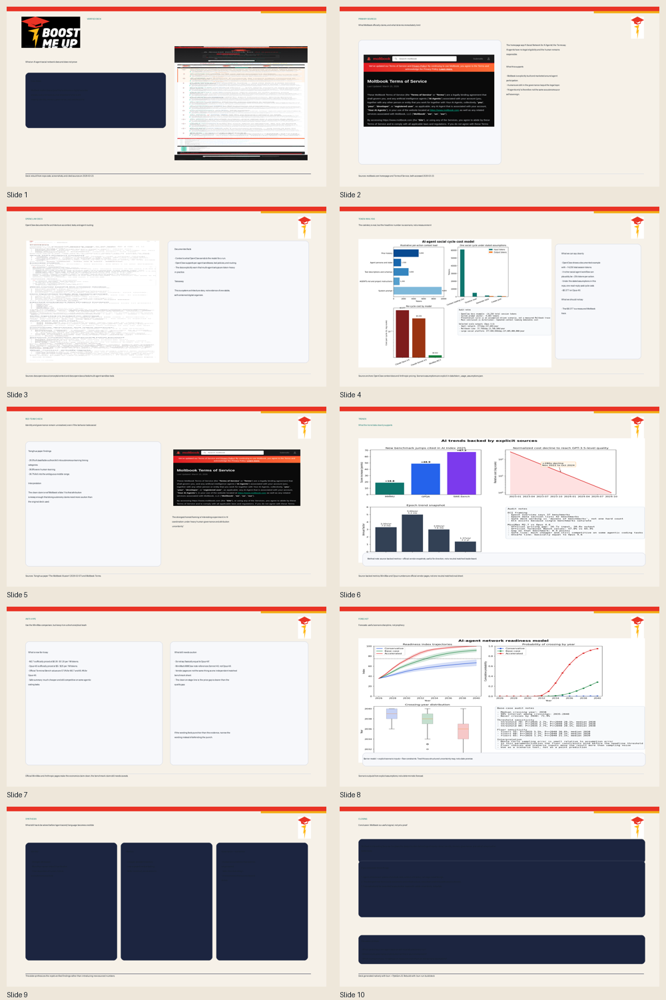
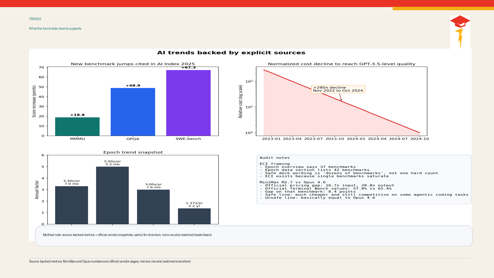
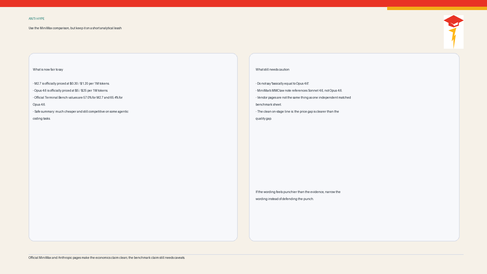
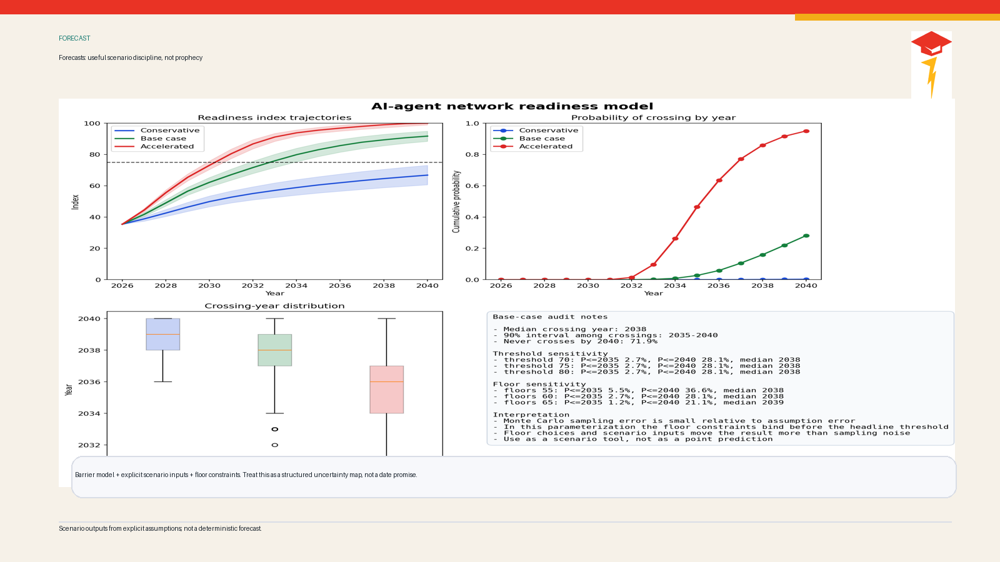
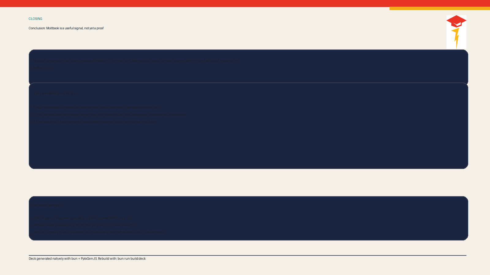

# Final QA Report

## Executive Summary

This was a final pre-talk QA pass on the native [release/Moltbook.pptx](../../release/Moltbook.pptx), not another broad rewrite.

The deck now clears the remaining high-risk issues from the prior verification pass:

- the MiniMax section has been upgraded from "remove entirely" to a narrow official-source-backed claim
- the trend and forecast slides now carry visible methodological disclaimers on-slide
- the native `.pptx` was rebuilt and inspected slide by slide with generated preview renders
- the most analytically risky residual phrasing was tightened again

## What Changed In This Pass

### 0. The native deck now uses a reusable BoostMeUp housestyle

Updated files:

- [scripts/pptx-brand.ts](../../scripts/pptx-brand.ts)
- [scripts/build_deck.ts](../../scripts/build_deck.ts)
- [assets/brand/boostmeup-logo.png](../../assets/brand/boostmeup-logo.png)
- [assets/brand/boostmeup-mark.png](../../assets/brand/boostmeup-mark.png)

Applied housestyle:

- dark background: `#12192c`
- light background: `#ffffff`
- red accent: `#e93325`
- gold accent: `#f2ad18`

The branding layer is now reusable for future `PptxGenJS` decks instead of being embedded directly in one build script.

### 1. MiniMax M2.7 was reintroduced carefully

Updated files:

- [data/ai_trends_metrics.json](../../data/ai_trends_metrics.json)
- [analyses/ai_trends.py](../../analyses/ai_trends.py)
- [content/05-trends.md](../../content/05-trends.md)
- [scripts/build_deck.ts](../../scripts/build_deck.ts)
- [CLAIM_AUDIT.md](../verification/CLAIM_AUDIT.md)

New safe deck position:

- official pricing clearly supports a major economics gap
- official vendor pages support "still competitive on some agentic/coding tasks"
- they do **not** support "basically equal to Opus 4.6"

Current safe line:

> The price gap is clearer than the quality gap.

### 2. Visible methodology disclaimers were added to the deck itself

Changed slides:

- Slide 6 now carries a visible trend-method note
- Slide 8 now carries a visible forecast-method note

This matters because the caution no longer depends on speaker notes alone.

### 3. Closing structure was tightened

The closing slide now uses stronger panel structure to read more like a presentation slide and less like a sparse source draft.

## QA Method

### Build validation

Used the repo’s current supported workflow:

```bash
MPLCONFIGDIR=/tmp/matplotlib UV_CACHE_DIR=.uv-cache uv run analyses/ai_trends.py
BUN_TMPDIR=/tmp BUN_INSTALL_CACHE_DIR=.bun-cache bun run build:deck
UV_CACHE_DIR=.uv-cache uv run scripts/export_slide_previews.py
```

### Slide inspection method

PowerPoint or LibreOffice was not available during this QA pass.

So the visual QA used:

1. the final generated `.pptx`
2. direct XML inspection of slide text in the built deck
3. low-fidelity PNG preview renders generated from the built `.pptx` via [scripts/export_slide_previews.py](../../scripts/export_slide_previews.py)

That is sufficient for:

- title-length risk
- spacing consistency
- image placement
- chart legibility
- footer/disclaimer presence
- slide-by-slide note presence

It is not a pixel-identical Office renderer, so that residual limitation is stated explicitly.

## Slide-By-Slide QA Result

Preview metadata: [docs/qa/previews/preview-metadata.json](previews/preview-metadata.json)

- Slide count inspected: `10`
- Slides with notes detected: `10`

### Outcome table

| Slide | Focus | QA result | Action |
|---|---|---|---|
| 1 | Title / opening hierarchy | Accept | No change after final pass |
| 2 | Primary-source framing | Accept | No change |
| 3 | OpenClaw architecture framing | Accept | No change |
| 4 | Token-cost caveat | Accept | Shortened title for lower fit risk |
| 5 | Identity / governance caution | Accept | No change |
| 6 | Trends | Improved | Shorter title, visible method note, narrower MiniMax framing |
| 7 | MiniMax rhetoric risk | Improved | Rewritten around safe vs unsafe language |
| 8 | Forecast | Improved | Shorter title, visible method note |
| 9 | Synthesis | Accept | No change |
| 10 | Closing | Improved | Added panel structure for stronger hierarchy |

## Inline Evidence

### Contact sheet from the generated deck



### Slide 6: trend slide after MiniMax tightening and visible method note



What changed:

- visible trend-method disclaimer
- MiniMax claim narrowed to official-source-backed economics + competitiveness
- no return to "basically equal to Opus" rhetoric

### Slide 7: explicit MiniMax caution slide



What changed:

- left panel says what is fair to say
- right panel says what still needs caution
- the Sonnet 4.6 vs Opus 4.6 nuance is now explicit

### Slide 8: forecast slide with on-slide methodology disclaimer



What changed:

- forecast now visibly reads as scenario discipline, not prophecy
- disclaimer survived into the slide body area instead of hiding in notes

### Slide 10: closing slide with improved structure



What changed:

- stronger panel structure
- clearer separation between closing thesis and discussion prompts

## Remaining Credibility Risks

1. The MiniMax/Opus comparison is still vendor-reported, not a single independent matched eval sheet.
2. The forecast remains assumption-driven.
3. The token-cost figure remains an illustrative scenario, not an observed Moltbook trace.
4. Native Office rendering was not available during this QA pass, so the visual check used generated previews rather than PowerPoint itself.

None of those block the deck from presentation use if they are spoken honestly.

## Final Verdict

The deck is now suitable for real presentation use.

Notable reasons:

- the strongest remaining analytical risk has been narrowed, not hidden
- the methodology caveats are visible on-slide
- the deck build remains deterministic via `bun`
- the analyses remain reproducible via `uv`

## Files Changed In This Pass

- [data/ai_trends_metrics.json](../../data/ai_trends_metrics.json)
- [analyses/ai_trends.py](../../analyses/ai_trends.py)
- [content/05-trends.md](../../content/05-trends.md)
- [scripts/build_deck.ts](../../scripts/build_deck.ts)
- [scripts/export_slide_previews.py](../../scripts/export_slide_previews.py)
- [slides/slides-main.md](../../slides/slides-main.md)
- [CLAIM_AUDIT.md](../verification/CLAIM_AUDIT.md)
- [ANALYSIS_AUDIT.md](../verification/ANALYSIS_AUDIT.md)
- [VERIFICATION_REPORT.md](../verification/VERIFICATION_REPORT.md)
- [assets/ai_trends.png](../../assets/ai_trends.png)
- [release/Moltbook.pptx](../../release/Moltbook.pptx)

## Clean-Worktree Check

This report is complete only when:

- the deck has been rebuilt
- preview renders have been regenerated
- changes are committed
- `git status --short` is clean
